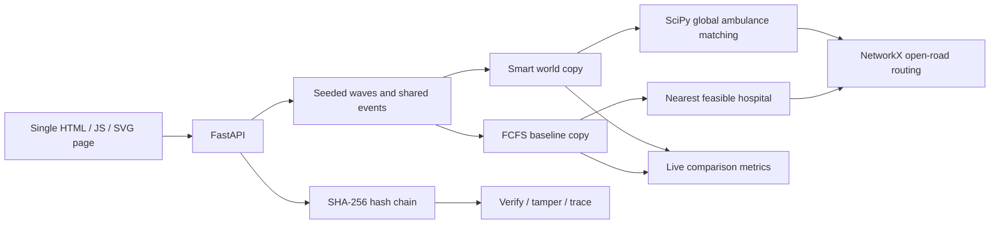

# Relief Lab — pre-hackathon prototype

A small, local disaster-response simulation with a smart allocator, a fair baseline, an offline SVG road map, and a tamper-evident audit trail. **No paid features, API keys, LLM calls, external map tiles, hosting subscription, or real blockchain.** All patients, resources and money are synthetic. Intended for a judge-facing demo, not real emergency operations.

## Run

Python 3.11+ (tested here with bundled Windows Python 3.12). Install free packages once while online; running the app requires no internet.

```powershell
python -m venv .venv
.\.venv\Scripts\Activate.ps1
pip install -r requirements.txt
python -m uvicorn app.api:app --host 127.0.0.1 --port 8000
```

Open http://127.0.0.1:8000. If PowerShell activation is restricted, use `.\.venv\Scripts\python.exe -m uvicorn app.api:app --host 127.0.0.1 --port 8000`. On macOS/Linux activate with `source .venv/bin/activate` instead. Do not use multiple server workers: this deliberately keeps one shared scenario in memory. API documentation: http://127.0.0.1:8000/docs.

```powershell
python -m pytest -q
```

## Architecture



- `app/sim.py`: seeded 49-node connected graph, five hospitals, ten ambulances, patient waves and metrics.
- `app/allocation.py`: shortest-path based assignment, reservations, discrete movement and event rerouting.
- `app/ledger.py`: canonical JSON hashing, chain verification, trace lookup.
- `app/api.py`: scenario scripts, identical event injection into independent policy copies, resource/fund demonstration, API and autoplay.
- `static/index.html`: all styling and JavaScript inline; no build, CDN or remote assets.

## Allocation and cost weights

For each idle ambulance / waiting patient pair, evaluate compatible hospitals, excluding blocked routes, full/offline hospitals, exhausted bed capacity, and missing blood. Critical patients require ALS. Trauma and burn patients require their matching hospital specialty; general patients may use any hospital. ICU and general beds are separate pools. Severity 1–2 patients reserve one blood unit.

The smart cost is:

```text
travel_to_patient_and_hospital
+ 4 × projected_bed_load_fraction
+ 8 × max(0, predicted_arrival_tick − deadline)
− 35 × (5 − severity)
− 2 × minutes_waiting
+ 3 if ALS would serve a noncritical patient
```

SciPy `linear_sum_assignment` solves the ambulance/patient matrix across the whole waiting pool, with dummy idle columns and forbidden costs. Hospital reservations are then finalized in severity/deadline order and costs recomputed against updated reservations. This two-stage heuristic prevents overbooking, but is **not a joint global optimum over all three dimensions**. A competing reservation can leave a selected patient waiting until the next tick. The explanatory text reports route time, deadline, specialty, projected bed load and score; it does not invent counterfactual claims about alternatives.

The baseline considers patients in arrival order, chooses the nearest available compatible ambulance, and sends it to the nearest feasible hospital. Both policies enforce the same safety/capacity rules and receive identical generated waves and events. No weights were tuned against a multi-seed benchmark; the initial weights above already improve deadline counts in the three seed-7 demos.

## Three demo walkthroughs

Use **seed 7**, click **Start / reset**, then **Step +10** four times to reach tick 40. Use single steps or autoplay to narrate events. Metrics update on every tick. Select Baseline allocation to inspect its map.

1. **Earthquake surge**: 14 initial patients; 18 additional patients at tick 4; a road collapses at tick 7. Watch routes and the Decisions / What changed panels. Click another road to close it and click again to reopen it.
2. **Hospital failure**: H1, the northwest trauma hospital, goes offline at tick 5. It is the nearest trauma option for part of the city. Onboard patients are rerouted and uncollected patients reconsidered. Select H1 and Restore to recover it.
3. **Supply shortage**: blood is exhausted at tick 5, 12 patients arrive at tick 6, and 24 donated units reach H4/H5 at tick 12. Inspect `BLOOD-002` in Ledger to see the replenishment and dispatch chain.

Observed at tick 40 with seed 7 (also regression-tested):

| Scenario | Overdue smart / baseline | Mean arrival minutes smart / baseline | Delivered smart / baseline |
|---|---:|---:|---:|
| earthquake_surge | 9 / 16 | 18.71 / 20.60 | 24 / 20 |
| hospital_failure | 3 / 7 | 17.69 / 19.86 | 13 / 14 |
| supply_shortage | 15 / 17 | 19.93 / 21.86 | 14 / 14 |

These are synthetic demonstrations, not evidence of clinical effectiveness. Smart does not win every metric or every seed. Mean arrival includes delivered patients only; compare it alongside overdue and delivered counts. Overdue means arrival after deadline or a still-undelivered patient currently past deadline. Peak load includes occupied plus reserved beds. Utilization is busy ambulance-ticks divided by total fleet-ticks, including broken vehicles in the denominator. Reallocation counts changed ambulance/hospital assignments, not a route-only update.

## Ledger demonstration

Open Ledger → Verify. The chain should be valid. Choose block 0 → **Tamper with block N** → verification reports the first invalid block. **Repair / reset scenario** discards the demo run and constructs a fresh scenario and chain; it does not silently rewrite the compromised history.

Trace `FUND-001` for donor → agency → field → vendor (partial balances remain in intermediate accounts); trace `BLOOD-001` for warehouse → field unit → H1. Both supply dispatches and receipts are explicit. Fund balances conserve the initial 10,000 synthetic units. The ledger records both policies' allocation decisions with a policy tag, but funds and supply transfers only once because they are shared external inputs.

Each block contains index, previous hash, simulated timestamp, tick, entry type, payload, and SHA-256 hash. Verification checks content, index, and previous hash. This demonstrates tamper evidence only: an attacker who rewrites the entire chain or truncates its tail can evade a verifier without an independently trusted head hash. No identifying data is accepted or stored; patients are generated P-number pseudonyms. Timestamps use a fixed epoch plus ticks for reproducibility.

## API examples

POST JSON to these endpoints (the UI uses the same API):

| Endpoint | Body |
|---|---|
| `/scenario/start` | `{"seed":7,"scenario":"earthquake_surge"}` |
| `/scenario/step` | `{"n":10}` |
| `/scenario/autoplay` | `{"enabled":true,"speed":2}` |
| `/events/block`, `/events/reopen` | `{"u":0,"v":1}` |
| `/events/hospital` | `{"hospital":"H1","status":"offline"}` (also full/normal) |
| `/events/surge` | `{"count":10}` |
| `/events/breakdown` | `{"ambulance":"A1"}` |
| `/events/shortage` | `{"resource":"blood"}` (also medicines) |
| `/ledger/tamper/0`, `/ledger/reset` | `{}` |

GET `/state`, `/decisions`, `/ledger`, `/ledger/verify`, `/ledger/trace/FUND-001`. Start validates seeds and names; steps are limited to 100 per call and surges to 50 patients. Start/reset pauses autoplay.

## Assumptions and limits

- One tick is a minute. Road traversal takes 1–3 ticks. Ambulances are displayed between nodes, but event rerouting restarts at the last reached node. Immediate supply receipt is a bookkeeping simplification.
- Patients waiting ten minutes worsen by one severity level; their original deadline remains. Critical patients then require ICU/ALS. Deadlines are synthetic (18/28/40/55 minutes), and overdue patients remain eligible for treatment.
- Ambulances remain at the delivery hospital, with no return-to-base delay. Breakdown releases the patient at the last reached node. Broken ambulances require a scenario reset to recover.
- Delivered patients occupy beds for the whole short demo. No discharges, mortality model, traffic congestion, triage uncertainty, or specialty treatment outcomes.
- Onboard patients with no feasible destination remain onboard with a reason, and retry on a recovery event. Reservations may be released during shortage/full events. No patient is admitted without a valid reservation.
- Medicines are a tracked stock only; blood affects allocation. Funds and supply transfers are scripted examples, not payment or inventory integrations. No real currency moves.
- State and the ledger are in memory and shared across browser tabs. Reset or process restart clears them. No authentication, database, distributed consensus, or deployment infrastructure; run on loopback for the demo.
- Ledger UI shows the most recent 70 matching blocks; API provides the full trace. The map may overlap patient markers during large surges.
- Next steps if the prototype is selected: joint capacity-constrained flow optimization, stronger explanation comparisons, persistence with an externally anchored ledger head, discharges, multi-seed evaluation and richer resource dispatch controls.

## Verification

Tests cover blocked roads, capacity reservations, events, fixed-seed replay including all scripts, nonnegative blood, fund conservation, supply traces, valid chains and tamper detection. Browser smoke checks cover page loading, stepping, and ledger controls. All three scenarios were run to tick 40 before delivery. The installed Starlette version emits a TestClient deprecation warning about httpx; it does not affect the running app or test results.
